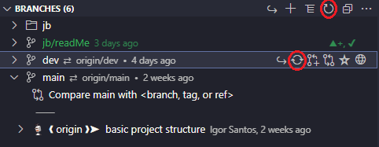
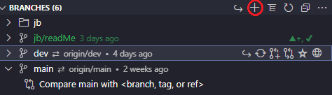
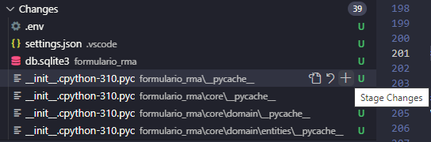
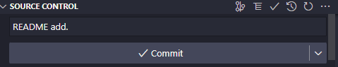
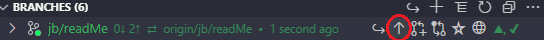
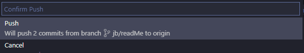
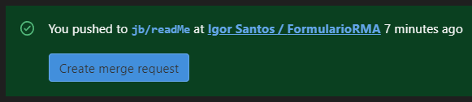
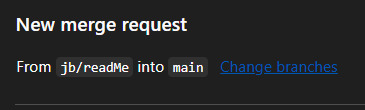
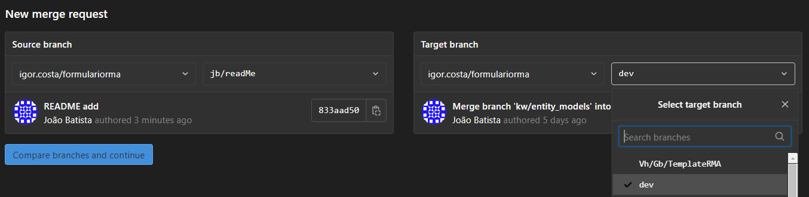
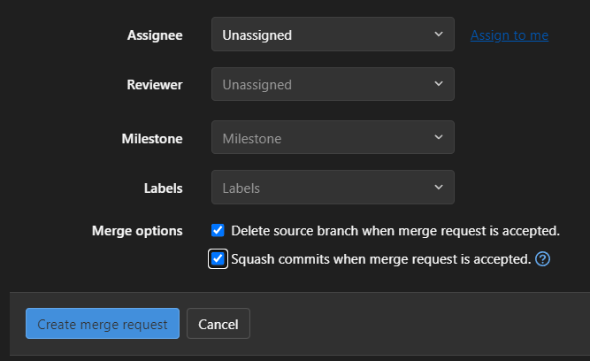

Sejam bem vindos ao nosso projeto FormularioRMA. Este projeto será desenvolvido em python seguindo os princípios de arquitetura limpa.

# Arquitetura limpa 
Arquitetura limpa no ramo de engenharia de software são vertentes de arquitetura de código que buscam facilitar o respeito aos princípios de bom desenvolvimento, incluindo os princípios SOLID. 
No geral, uma boa arquitetura deve ser responsável por separar o nosso código, nossas regras de negócio, de dependências externas. 

## Regras de negócio 
Regras de negócio são o motivo de nosso software existir. Para um banco elas envolvem a gestão de contas e serviços do banco, para o photoshop elas envolvem manipulação de imagem, para um jogo elas envolvem o design do jogo (as regras de jogo) e por aí vai. Esse é um conceito amplo que diz o motivo pelo qual você esta fazendo o software. 

## Dependências externas 
Dependência externa é basicamente todo o resto. Se não tem a ver com o nosso código em si, se não é nosso, é uma dependência externa. A web é uma dependência externa! A database é uma dependência externa! A máquina em que o código irá rodar é uma dependência externa! Acho que você entendeu a ideia.

# As camadas


Nosso código será dividido em camadas (layers). Você talvez não saiba o que é uma camada, mas há grandes chances de você já ter ouvido falar disso alguma vez porque é um padrão extremamente eficiente. 
Primeiramente, vamos desmitificar isso: camadas são conjuntos de código, só isso. No geral, nesse projeto, as camadas vão ser simplesmente diferentes pastas na estrutura do projeto. Agora nós podemos discutir algumas regras gerais para camadas: 
- As camadas têm hierarquia entre elas, sendo que há camadas mais internas e camadas mais externas. No caso de arquitetura limpa, as camadas mais internas cuidam das nossas regras de negócio, enquanto as mais externas cuidam das nossas dependências externas.
- As camadas são autorizadas a saberem de tudo que ocorre nela, então dois códigos que fazem parte da mesma camada podem se comunicar entre si. 
- Camadas externas são autorizadas a saberem de camadas internas, mas camadas internas não podem saber de camadas externas. No caso da arquitetura limpa, nós garantimos que nossas regras de negócio não serão afetas pelas dependências externas. Isso significa que você pode fazer uma camada externa que é um aplicativo mobile, ou uma camada externa que é uma página web, porém suas regras de negócio são compartilhadas entre suas aplicações.
- As camadas mais internas são mais estáveis. Isso significa que se você mudar um código numa camada interna, você terá que mudar o código nas camadas externas, pois elas dependem da camada interna. Isso faz com que mudar uma camada interna seja muito mais difícil de mudar uma camada externa e isso é excelente! As suas regras de negócio devem ser estáveis, pois elas determinam como seu negócio funciona. Mas a sua interface gráfica deve ser instável, pois você pode querer muda-la por usabilidade ou algo do tipo.

Pois bem! Vamos estudar sobre as camadas na arquitetura limpa: 

## O domínio 
O domínio é a nossa camada mais interna. Ele é composto sobretudo de entidades.

### Entidades
Entidades são classes que encapsulam os dados de nossa aplicação e regras de negócio que não dependem do fato de estarmos em uma aplicação automatizada. Imagine que você está criando uma aplicação para gerenciar uma rede de transportes e logística. Pense nas entidades Usuários e Endereços. Devido a natureza do negócio, um objeto da classe usuário não deve poder existir sem o endereço, porque nós precisamos do endereço para entregar a encomenda. Logo, isso é uma regra de negócio que pode ser encapsulada direto na entidade: a aplicação só deixa você instanciar um usuário se ele tiver um endereço. 
Algumas pessoas preferem deixar a entidade apenas como dados e colocar essas regras em outro componente na mesma camada.
Observação: Entidades são altamente relacionadas a modelos. Muitas pessoas dizem que são a mesma coisa, mas algumas vezes modelos vêm como entidades que são da camada de aplicação e não de domínio. Esses detalhes não são tão importantes de saber de cór, só se lembre de seguir as convenções do seu time.

### Repositórios
Repositórios são uma forma de interagir com as entidades, muitas vezes se relacionam com persistência. O repositório não sabe o que implementa essa persistência, ele não liga se é uma database, um arquivo, ou mesmo só uma estrutura de dados na RAM. É apenas uma interface que os casos de uso podem usar para recuperar e salvar entidades. Basicamente os repositórios são responsáveis por criar entidades.


## A aplicação
A camada de aplicação é a nossa camada intermediária. Ela envolve o que nossa aplicação faz de fato. Aqui nós temos as regras que se relacoinam ao fato de estarmos fazendo um sistema automatizado. Aqui nós temos o que será exposto para a nossa interface de usuário seja como ela é.

### Casos de uso
Casos de uso são as funções que determinam o que a nossa aplicação faz de fato. São os casos em que nossa aplicação pode ser usada. Basicamente são funções responsáveis por fazer o que a nossa aplicação deve fazer

## Infraestrutura
A camada de infraestrutura está relacionada com as nossas dependências externas. Essa camada é onde nós podemos falar sobre web, mobile, CLI, databases ou qualquer outra dependência. 

### Implementação de repositórios
A implementação concreta dos repositórios fica nessa camada! Aqui você pode implementar repositórios com databases ou qualquer outra coisa.

### Controllers 
Controller são classes responsáveis por apresentar os nossos casos de uso. Pode ser que nossos casos de uso sejam expostos através de uma página web, ou através de um arquivo de configuração. Qualquer coisa desse tipo é resolvida nos controllers
Os controllers também são responsáveis por injetar dependências externas nos casos de uso. Os casos de uso precisam da interface de repositórios para funcionarem, e os controllers injetam a implementação do repositório dentro do caso de uso.

### Presenters 
Presenters são responsáveis por traduzir as nossas entidades para algo apresentável. Por exemplo, talvez a sua entidade salve datas em timestamps e o presenter é responsável por traduzir o timestamp para o formato de data do usuário.


## Ferramentas necessárias
- 1° Python versão 3.10 -> (LINK: https://www.python.org/downloads) ou pela Microsoft Store;
- 2° Visual Studio Code -> (LINK: https://code.visualstudio.com/download) ou pela Microsoft Store;
- 3° Git Bash -> (LINK: https://git-scm.com/downloads).

## Extensões necessárias (VS Code)
- 1° Python, junto com o formatador autopep8 e algum linter;
- 2° GitLens.


## Python
A linguagem de programação Python é muito interessante como primeira linguagem de programação devido à sua simplicidade e clareza. Embora simples, é também uma linguagem poderosa, podendo ser usada para administrar sistemas e desenvolver grandes projetos. É uma linguagem clara e objetiva, apresentando uma legibilidade dos programas escritos nessa linguagem invejável.

Python é software livre, ou seja, pode ser utilizada gratuitamente, graças ao trabalho da Python Foundation1 e de inúmeros colaboradores. Pode-se utilizar Python em praticamente qualquer arquitetura de computadores ou sistema operacional.

Python vem crescendo em várias áreas da computação, como inteligência artificial, banco de dados, biotecnologia, animação 3D, aplicativos móveis (celulares), jogos e mesmo como plataforma web. Isso explica por que Python é famosa por ter "batteries included'; ou seja, baterias inclusas, fazendo referência a um produto completo que pode ser usado prontamente. Com várias bibliotecas usando bindings (versão) em Python.

### Django (framework)
Django é um framework web da linguagem Python, de alto nível que encoraja o desenvolvimento rápido e design limpo e pragmático. Ele resolve grande parte do incômodo do desenvolvimento da Web, para podermos concentrar-se em escrever sua aplicação sem precisar reinventar a roda. É gratuito e de código aberto.


# Sejam bem-vindos ao controle de versão, galera: 

> O que é controle de versão: 

O controle de versão é uma forma de rastrear e gerenciar as alterações em um código de software. 

Exemplificando de forma objetiva o controle de versão para o mundo do Git:

Sempre que alguém fizer uma alteração no Git isso será registrado, assim será possível analisar o código posteriormente. 

> Diferença entre Git e GitLab/GitHub:

- Git: É um sistema de controle de versão em código aberto. É por esse sistema que será encontrado o histórico de alterações. 

- Já o GitLab/GitHub são plataformas de hospedagem. 

Os dois são similares, porém o GitLab permite que os desenvolvedores armazenem o código em seu próprio servidor, enquanto o GitHub trabalha em servidores de terceiros. 

# Prática: 

> Tutorial de como clonar o projeto: 

Fala, galera!

1. Você precisará de um programa chamado **GITBASH** em sua máquina.

2. Chave pública: 
Você deverá saber se possui uma chave pública. 
Para isso use esse comando: 

```cat ~/.ssh/id_rsa.pub```

Se você não possuir a chave, utilize esse outro comando:

```ssh-keygen```

3. Dê o comando Public Key ``cat ~/.ssh/id_rsa.pub`` e copie o conteúdo. 

4. Acesse o site do GitLab aqui da sedes ``https://gitlab.sedes.df.gov.br/``

5. Clique sobre o seu avatar e clique em "edit profile" e posteriormente em SSH KEYS, ou então cole o seguinte link abaixo em seu navegador:
``https://gitlab.sedes.df.gov.br/-/profile/keys``

6. Lembra do conteúdo da sua public key que você adquiriu com o comando cat ~/.ssh/id_rsa.pub. 
Cole este conteúdo da sua chave pública no campo KEY.

7. Clique no botão ADD KEY. PRONTO! A sua chave SSH está adicionada. 

Agora faça o seguinte: 

-  Clique em "Menu" 
-  Selecione "Projects"
-  Clique sobre o projeto desejado (FormularioRMA)
-  Depois disso, clique no botão "Clone" para copiar a URL
-  Clique no botão clone para copiar a URL

Vá agora para o terminal do GITBASH e faça o seguinte: 

execute o seguinte comando ``git clone`` + A URL que você copiou no GITLAB. 

Dessa forma: 

``git clone git@gitlab.sedes.df.gov.br:igor.costa/formulariorma.git``

DÊ ENTER e espere! 

Digite o codigo a seguir para abrir o vs code na pasta durante o procedimento:

``code . ``

Feito isso você terá o projeto clonado no seu computador! 

Será gerado uma pasta com o nome do projeto "formulariorma".

# Configurar a chave SSH no Gitlab: 

- Abra o GITBASH e execute esse comando: 

``cd .ssh/``

- Pressione ENTER e digite posteriormente: 

``ls``

- Pressione ENTER e então execute o comando: 

``code config``

- Você então será direcionado ao Visual Studio: 

Jogue essas linhas de código para executar a configuração (ATENÇÃO PARA AS QUEBRAS DE LINHAS):

    Host gitlab.sedes.df.gov.br
        HostName gitlab.sedes.df.gov.br
        Port 2222

## Configurar nome de usuário e email no GIT
Ao instalar o Git Bash, a primeira coisa que devemos fazer é configurar o usuário e email, pois cada commit usará essa informação.

```git config --global user.name "Fulano de Tal"```
```git config --global user.email fulanodetal@exemplo.br```

Você precisará fazer isso somente uma vez se tiver usado a opção --global. Tendo em vista que o Git usará esta informação para
qualquer coisa que você fizer naquele sistema. Se você quiser substituir essa informação com nome diferente para um 
projeto específico, você pode rodar o comando sem a opção --global dentro de um determinado projeto.


### Boas práticas de Commit
Antes de dar Commit, é importante adicionar os arquivos necessários, intuitivamente já queremos dar git add. para adicionar todas as modificações e dar logo o commit. Caso todos os arquivos que você modificou e/ou criou tenham coisas em comuns, não há problema, mas se for diferentes coisas é necessário separar cada arquivo ou "lote de arquivos em comum" em um commit, especificando a mensagem de maneira simples e de fácil entendimento.

### Bons e Maus Exemplos de mensagem de commit
❌ "cargo.py e pessoa.py add, cargo.py e vinculos.py modificados"

❌"Erros corrigidos"

❌ "Entidade adicionada"

❌ "Modificado o Getter da entidade pessoa e adicionado condições no setter"

<br>

✅ "cargo.py e pessoa.py add"

✅ "cargo.py modificado"

✅ "vinculos.py add"

✅ "pessoa.py e vinculos.py modificados"


## Branch
É preciso conectar com o remote e criar uma dev local, depois é necessário criar uma branch a partir da dev local. **LEMBRE-SE SEMPRE DE ATUALIZAR A DEV.**

### Criar Branch
Vá para Source Control e atualize a dev local.





Agora, é só clicar no ícone de mais (Create Branch) e dá o pull com o nome correto.
Pronto, a branch já está criada e você poderá trabalhar através dela.

### Realizar Commit


Ainda em Source Control, em Changes, escolha os arquivos que você quer enviar. Para isso, basta passar o mouse em cima e clicar no ícone de adição.



Feito isso, é só colocar a mensagem e clicar em Commit.

Agora você precisará dar o pull para enviar para o GiLab. É só clicar na seta para cima e confirmar:






Após ter feito o pull, aparecerá uma mensagem no GitLab pedindo para fazer o merge request.



O próximo passo e mudar a Branch da main para dev. Fique à vontade para deixar algum comentário.
Clique em "Change branches". Na parte de Target branch, seleciona a branch dev e dê continue.






Ao clicar em "Create merge request", dê um Assign to me para atribuí-lo a você, marque a opção "Squash commits when merge request is accepted" e vá em "Creat merge request". **SEMPRE QUE VOCÊ CRIAR UM MERGE REQUEST, PRECISARÁ REPETIR ESTES MESMOS PASSOS.**




PRONTO! AGORA ESTÁ TUDO CERTO.


## Boas práticas de Branch
A branch deverá conter as iniciais do nome, seguido do nome do ticket. 
```Ex: Funalano de Tal -> fl/nomedabranch ou ft/nomedabranch```

### Separando os commits em lotes
Caso você tenha criado o arquivo cargo.py, pessoa.py e vinculos.py, não há problema coloca-los em um mesmo commit, já que são ações parecidas para arquivos e você pode especificar e deixar claro o que foi feito em poucas palavras, mesma coisa para modificações. Caso você tenha criado 2 arquivos e modificados outros 2, o ideal é adicionar os 2 criados, fazer o commit com a mensagem especifica, então adicionar os 2 modificados, e criar outro commit com a mensagem especifica .

## Templates de mensagens de commit
```git commit -m "nomeDoArquivo.py add"```

```git commit -m "nomeDoArquivo.py e nomeDoArquivo2.py add"```

```git commit -m "nomeDoArquivo.py modificado"```

```git commit -m "nomeDoArquivo.py mod"```

```git commit -m "nomeDoArquivo.py fix"```

```git commit -m "nomedoArquivo.py e nomeDoArquivo2.py modificado"```

## Tickets
- Qualquer pessoa pode pegar qualquer ticket (não há ordem/nível de prioridade) no quadro kanban.

- Cada ticket possui níveis de dificuldade (sotyPoints) diferentes, indo do 1 ao 5.

- Ao pegar um ticket, primeiro, temos que passá-lo para andamento e, após concluí-lo, é preciso fazer o pull request para enviar o(s) arquivo(s). Em seguida, o ticket é passado para Homologação. 

- É necessário a aprovação de dois revisadores, durante a etapa de Homologação. Caso esteja tudo de acordo, o ticket é fechado (movido para Closed), caso contrário, o ticket volta para o campo de andamento para o devido responsável com finalidade de realizar a manutenção.
